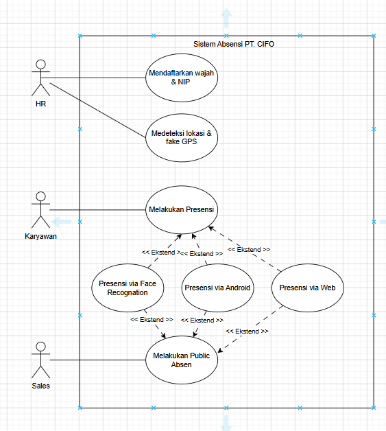
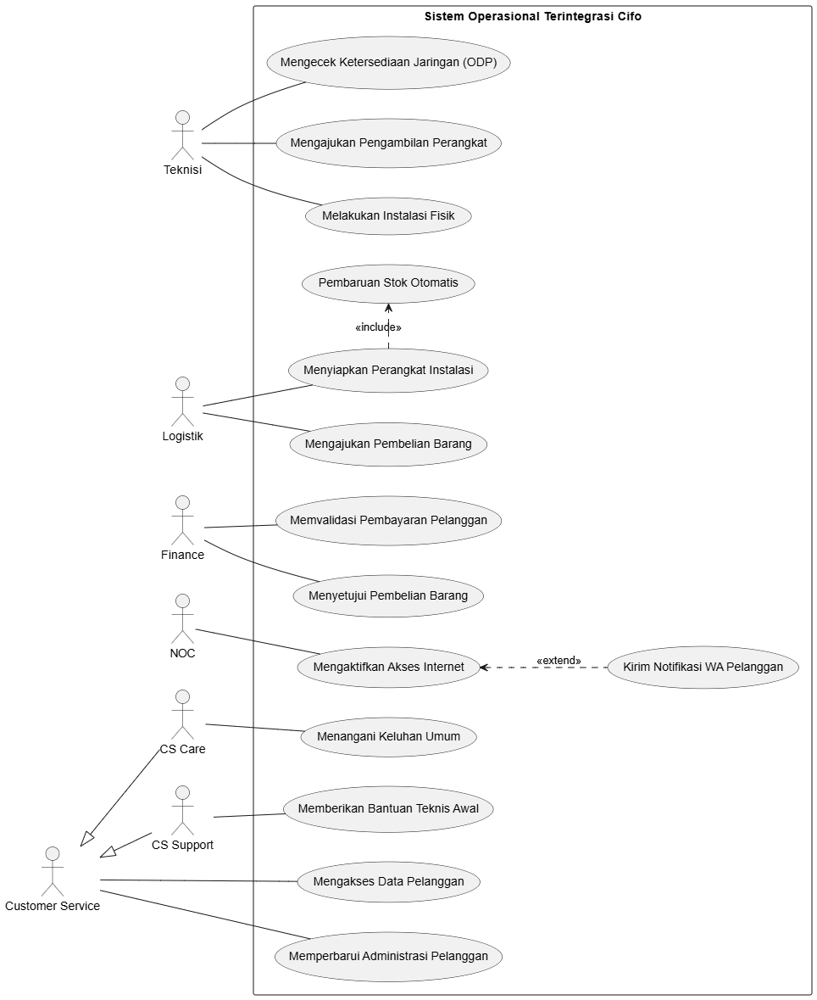
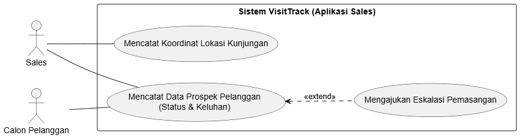
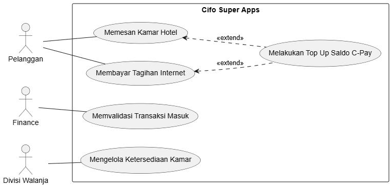
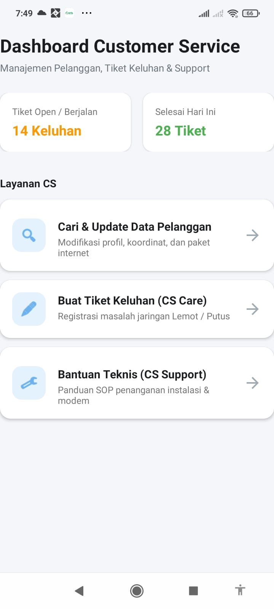
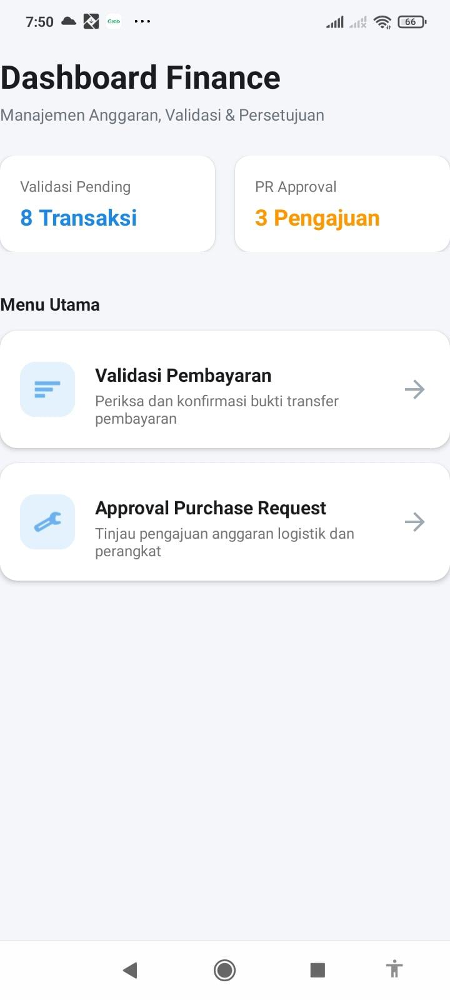
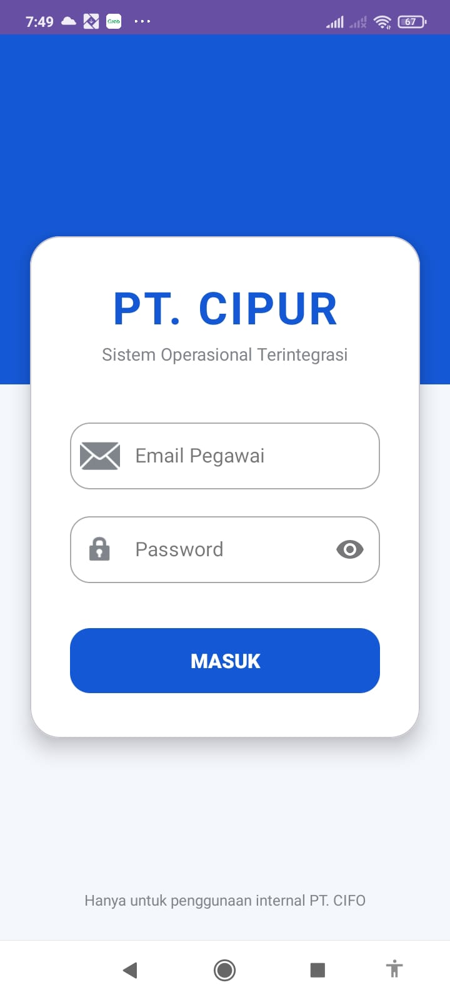
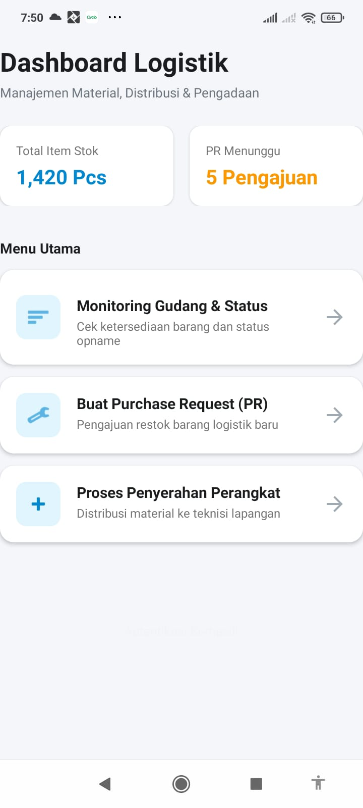
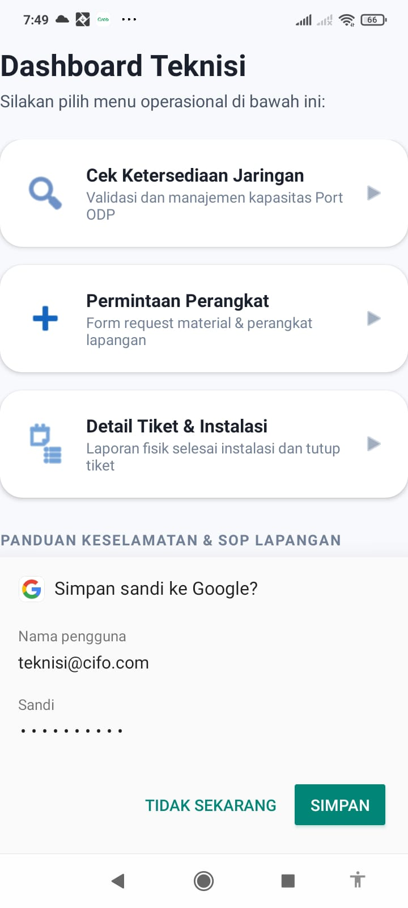

# Pemrograman Mobile 1

## Project Tugas Besar

### Deskripsi Proyek

Proyek ini adalah merupakan tugas besar mata kuliah **Pemrograman Mobile 1** yang dikerjakan secara berkelompok oleh 4 mahasiswa. Aplikasi ini dikembangkan untuk mengimplementasikan konsep-konsep pemrograman mobile yang telah dipelajari selama perkuliahan, seperti desain antarmuka, navigasi, manajemen data, dan fitur-fitur mobile lainnya.

### Tujuan Proyek

- Menerapkan konsep dasar pengembangan aplikasi mobile.
- Melatih kerja sama tim dalam pengembangan perangkat lunak.
- Menghasilkan aplikasi yang fungsional dan mudah digunakan.
- Mengimplementasikan praktik pengembangan perangkat lunak yang baik.

## Anggota Kelompok

| No  | Nama                    | NIM          | Role    
| --- |-------------------------|--------------|---------
| 1   | Adrian Fathurahman      | 24552011106  | UI/UX Engineer 
| 2   | Andrian Maulana Dzikwan | 24552011027  | Developer & Tester 
| 3   | Fahridzal Nur Sidiq     | 24552011315  | UI/UX Engineer 
| 4   | Muhammad Rifaldy        | 24552011288  | UI/UX Engineer 

### Teknologi yang Digunakan

- Android Studio
- Kotlin
- Firebase
- XML Layout
- Git & GitHub

---
## Dokumentasi Use Case

| Sistem Internal | Sistem Operasional |
| :---: | :---: 
|  |  | 

| Visit Track | Super Apps |
| :---: | :---: |
 |  |

---

## Dokumentasi Screenshot

| Customer Service | Finance | Login |
| :---: | :---: | :---: |
|  |  |  |

| Logistik | Teknisi |
| :---: | :---: |
|  |  |

---

Tentu, ini adalah versi yang lebih rapi dan profesional untuk bagian "Cara Menjalankan Project" di `README.md` Anda. Saya menggunakan format *bullet points* dan *code blocks* agar instruksinya lebih mudah dibaca:

---

## Cara Menjalankan Project

Ikuti langkah-langkah berikut untuk menjalankan aplikasi di perangkat Anda:

### 1. Kloning Repository

Buka terminal pada direktori yang Anda inginkan, lalu jalankan perintah berikut:

```bash
git clone [MASUKKAN_LINK_REPO_ANDA_DISINI]

```

### 2. Membuka di Android Studio

Setelah proses *cloning* selesai, silakan buka project dengan cara:

1. Buka aplikasi **Android Studio**.
2. Pilih menu **File > Open**.
3. Navigasikan ke folder `repo(app)` yang telah Anda kloning sebelumnya.
4. Tunggu hingga proses sinkronisasi Gradle selesai.
5. Klik tombol **Run** (ikon segitiga hijau) untuk menjalankan aplikasi pada emulator atau perangkat fisik.

---
 
 ## Link Demo dan penjelasan
 https://drive.google.com/drive/folders/14u_cGDvckPWm9KfAXz2s3vrr6RXKwqog
 
